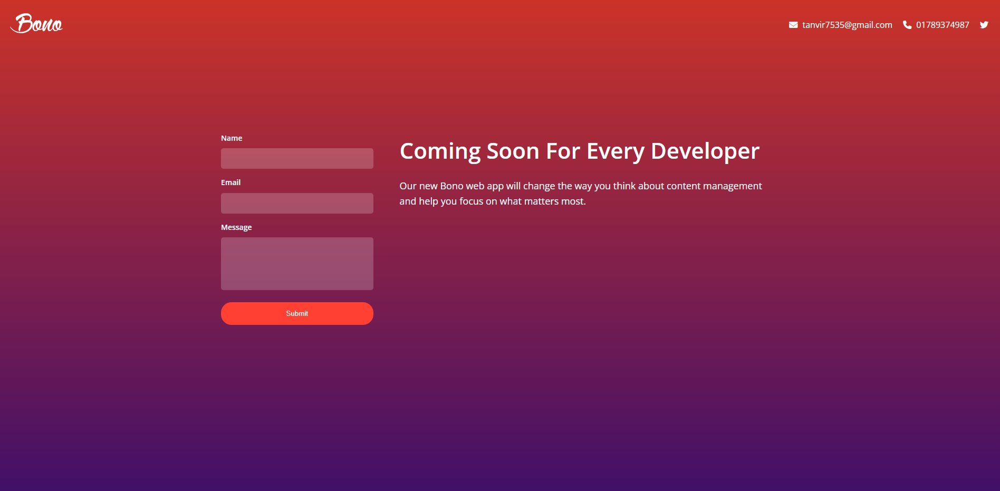
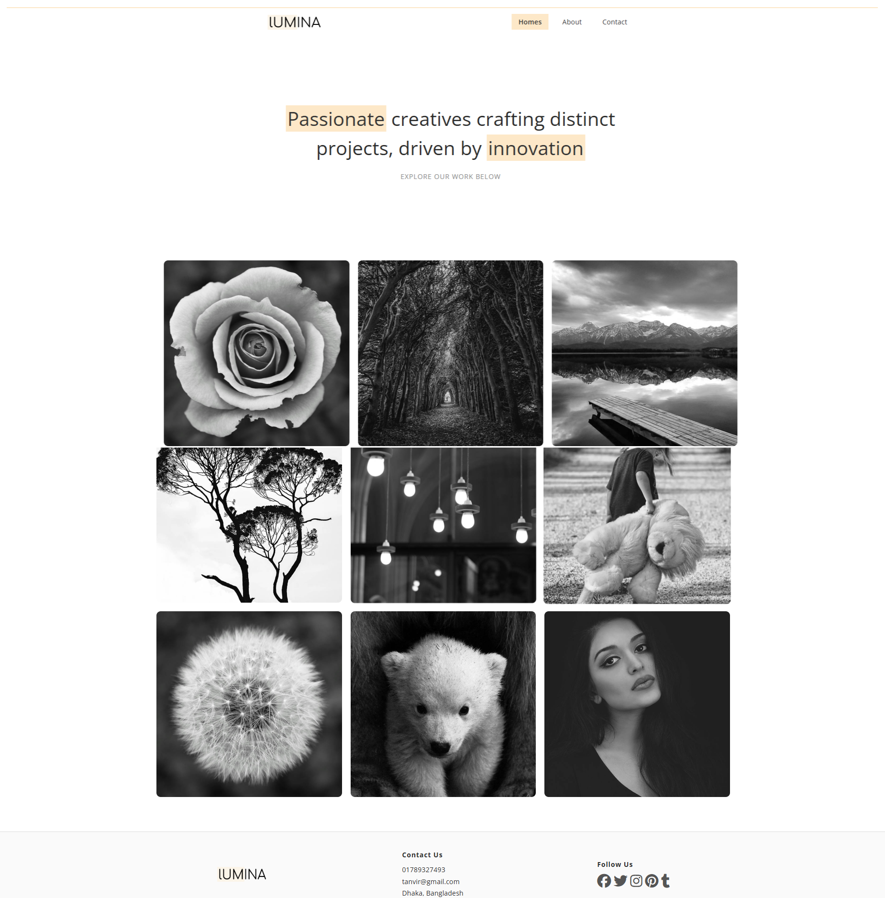
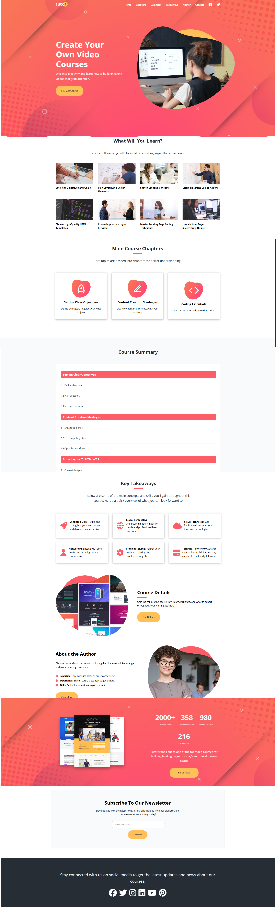
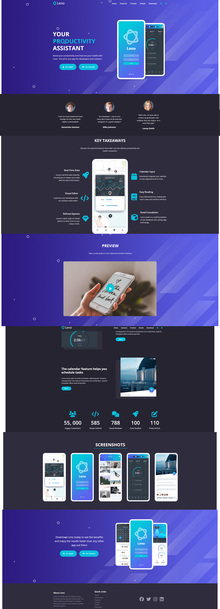

# HTML & CSS Mastery

A collection of learning exercises and fully responsive website projects built while completing **Modern HTML & CSS From The Beginning 2.0** by Brad Traversy on Udemy. Covers everything from HTML5 basics and CSS fundamentals through Flexbox, CSS Grid, animations, and real-world project builds — no JavaScript frameworks used.

---

# 🚀 Live Projects

| # | Project | Live Demo |
|---|---------|-----------|
| 1 | **Bono Landing Form** | [🔗 Live](https://landing-form-tanvir.netlify.app/) |
| 2 | **Lumina Creative** | [🔗 Live](https://lumina-tanvir.netlify.app/) |
| 3 | **Tutor Website** | [🔗 Live](https://tutor-tanvir.netlify.app/) |
| 4 | **Leno Website** | [🔗 Live](https://leno-tanvir.netlify.app/) |

---

## Topics Covered

- Semantic HTML5
- CSS3 fundamentals - box model, positioning, specificity
- Flexbox and CSS Grid layouts
- Responsive design with media queries
- CSS custom properties (variables)
- Transitions and animations
- Advanced selectors and pseudo-classes
- BEM naming convention
- Reusable utility classes
- Lightbox integration
- Font Awesome icons & Google Fonts
- Deploying static sites on Netlify

---

## Folder Structure

```
HTML-CSS-MASTERY/
├── learning-modules/
│   ├── css/
│   │   ├── 01-css-basics
│   │   ├── 02-box-model-and-positioning
│   │   ├── 03-flexbox
│   │   ├── 04-responsive-design
│   │   ├── 05-various-css-features
│   │   ├── 06-advanced-selectors-and-pseudo-classes
│   │   ├── 07-css-grid
│   │   └── 08-transitions-and-animations
│   └── html/
│       ├── 01-essential-html
│       ├── 02-html-forms
│       └── 03-more-html
├── projects/
│   ├── 01-landing-form
│   ├── 02-lumina-website
│   ├── 03-tutor-website
│   └── 04-leno-website
├── reference-guide/
└── screenshots/
```

---

## Running Locally

```bash
git clone https://github.com/your-username/html-css-mastery.git
cd html-css-mastery
```

Navigate into any project folder, for example:

```bash
cd projects/01-landing-form
```

Then open `index.html` with the **Live Server** extension in VS Code for auto-reload on changes, or simply double-click the file to open it in your browser.

---

## Projects

### 1. Bono — Landing Page with Form

A clean, responsive landing page with a styled sign-up form.

- Flexbox layout
- Form styling
- Fully responsive

**[Live Demo](https://landing-form-tanvir.netlify.app/)**



---

### 2. Lumina — Portfolio Website

A fully responsive portfolio site with a CSS Grid layout and lightbox image gallery.

- CSS Grid-based layout
- Multi-page structure
- Lightbox integration
- Fully responsive

**[Live Demo](https://lumina-tanvir.netlify.app/)**



---

### 3. Tutor — Online Tutoring Website

A multi-page tutoring website with smooth navigation and a dedicated contact page.

- Multi-page structure
- Smooth scrolling navigation
- Reusable utility classes
- Contact page included

**[Live Demo](https://tutor-tanvir.netlify.app/)**



---

### 4. Leno — Productivity App Landing Page

A fully responsive productivity assistant landing page built with Flexbox and CSS Grid.

- Flexbox & CSS Grid layout
- BEM naming convention
- Clean semantic HTML structure

**[Live Demo](https://leno-tanvir.netlify.app/)**



---

## Course

[Modern HTML & CSS From The Beginning 2.0](https://www.udemy.com/course/modern-html-css-from-the-beginning/) — Brad Traversy, Udemy

> For educational purposes only. Project designs are inspired by course material.